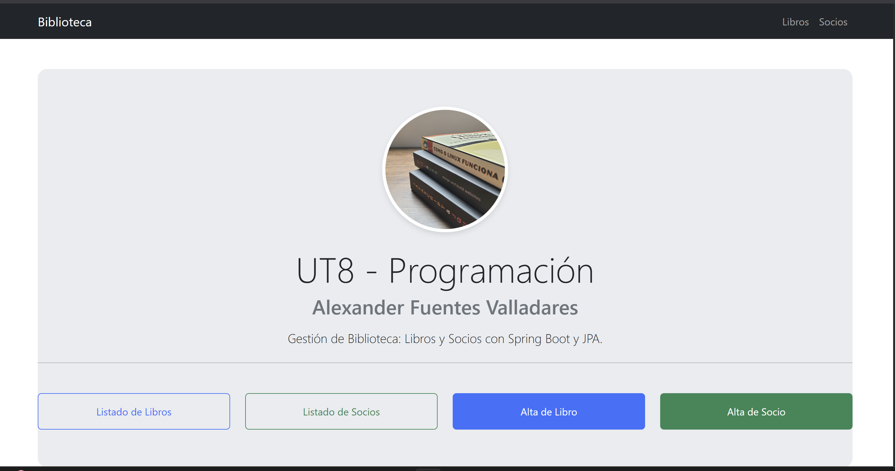
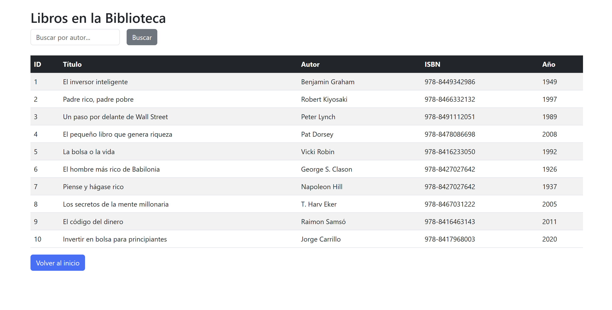
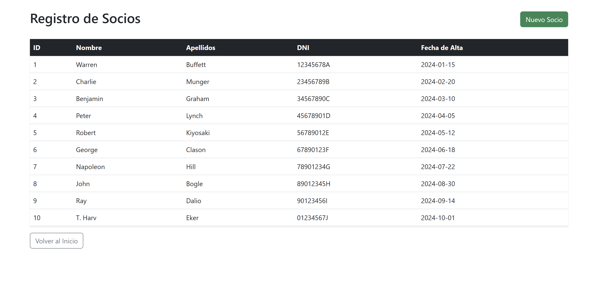




---

# 📚 Biblioteca Deploy Project

## 📋 Descripción del Proyecto

**Biblioteca Deploy Project** es una aplicación web desarrollada con **Spring Boot 3.3.0** que permite gestionar una biblioteca digital. La aplicación facilita la administración de libros y socios, proporcionando funcionalidades para listar y dar de alta tanto libros como miembros de la biblioteca.

### ✨ Características principales:
- ✅ Gestión completa de libros (listar y crear)
- ✅ Gestión de socios/miembros de la biblioteca (listar y crear)
- 🎨 Interfaz web moderna con **Thymeleaf + Bootstrap 5**
- 🗄️ Persistencia de datos con **JPA / Hibernate + MySQL**
- 🚀 Desplegado en **Railway** (cloud)

---

## 🛠️ Tecnologías Utilizadas

| Tecnología | Versión | Propósito |
|------------|---------|-----------|
| ☕ Java | 17 | Lenguaje de programación |
| 🌱 Spring Boot | 3.3.0 | Framework web |
| 🗄️ Spring Data JPA | 3.3.0 | Persistencia de datos |
| 🎨 Thymeleaf | 3.3.0 | Motor de plantillas |
| 🐬 MySQL | 8.0 | Base de datos |
| 📦 Maven | 3.6+ | Gestor de dependencias |
| 🚀 Railway | - | Plataforma de despliegue |

---

## 🔧 Requisitos Previos

Antes de ejecutar el proyecto localmente, asegúrate de tener instalado lo siguiente:

| Requisito | Versión | Descripción |
|-----------|---------|-------------|
| ☕ **Java** | 17+ | Lenguaje de programación |
| 📦 **Maven** | 3.6+ | Gestor de dependencias |
| 🐬 **MySQL** | 5.7+ | Base de datos |
| 🔗 **Git** | 2.0+ | Control de versiones |

---

## 🚀 Pasos para Ejecutar el Proyecto (Local)

### 1️⃣ Clonar el Repositorio

```bash
git clone https://github.com/rvssian666/bibloteca-deploy-project.git
cd bibloteca-deploy-project
```

### 2️⃣ Crear la Base de Datos

Abre MySQL y ejecuta el script SQL incluido:

```bash
mysql -u root -p
```

Luego, en la consola de MySQL:

```sql
CREATE DATABASE IF NOT EXISTS bibloteca;
USE bibloteca;
source schema.sql;
```

**O directamente desde la terminal:**

```bash
mysql -u root -p < schema.sql
```

### 3️⃣ Configurar application.properties

Edita el archivo `src/main/resources/application.properties` con tus credenciales de MySQL:

```properties
spring.datasource.url=jdbc:mysql://localhost:3306/bibloteca?createDatabaseIfNotExist=true&serverTimezone=UTC
spring.datasource.username=root
spring.datasource.password=tu_contraseña_mysql
spring.datasource.driver-class-name=com.mysql.cj.jdbc.Driver

spring.jpa.hibernate.ddl-auto=update
spring.jpa.show-sql=true
spring.jpa.properties.hibernate.dialect=org.hibernate.dialect.MySQL8Dialect

server.port=8080

spring.thymeleaf.cache=false
spring.thymeleaf.prefix=classpath:/templates/
spring.thymeleaf.suffix=.html
```

### 4️⃣ Compilar y Ejecutar

**Opción A: Usando Maven directamente**

```bash
mvn clean install
mvn spring-boot:run
```

**Opción B: Usar el wrapper de Maven (recomendado)**

```bash
# En Windows
mvnw.cmd spring-boot:run

# En Linux/Mac
./mvnw spring-boot:run
```

### 5️⃣ Acceder a la Aplicación

Una vez que la aplicación esté ejecutándose, abre tu navegador y accede a:

```
http://localhost:8080/inicio
```

---

## 📸 Capturas de Pantalla

### Página de Inicio


### Listado de Libros


### Listado de Socios


---

## 📁 Estructura del Proyecto

```
bibloteca-deploy-project/
├── src/
│   ├── main/
│   │   ├── java/
│   │   │   └── com/practicaJPA/bibloteca/
│   │   │       ├── BiblotecaApplication.java      # Clase principal (controlador)
│   │   │       ├── model/                          # Entidades JPA (Libro, Socio)
│   │   │       └── Repository/                     # Interfaces JpaRepository
│   │   └── resources/
│   │       ├── application.properties              # Configuración
│   │       └── templates/                          # Vistas Thymeleaf
│   │           ├── inicio.html
│   │           ├── listado-libros.html
│   │           ├── listado-socios.html
│   │           ├── formulario-libro.html
│   │           ├── formulario-socio.html
│   │           └── error.html
│   └── test/                                       # Tests unitarios
├── docs/
│   └── screenshots/                                # Capturas de pantalla
├── pom.xml                                         # Configuración Maven
├── schema.sql                                      # Script de base de datos
├── Procfile                                        # Configuración para Railway
├── mvnw                                            # Maven wrapper (Linux/Mac)
├── mvnw.cmd                                        # Maven wrapper (Windows)
└── README.md                                       # Este archivo
```

---

## 🗄️ Base de Datos

### Tablas Principales

**Tabla: libro**
```sql
CREATE TABLE IF NOT EXISTS libro (
    id INT AUTO_INCREMENT PRIMARY KEY,
    titulo VARCHAR(255),
    autor VARCHAR(255),
    isbn VARCHAR(20),
    anio_publicacion INT
);
```

**Tabla: socio**
```sql
CREATE TABLE IF NOT EXISTS socio (
    id INT AUTO_INCREMENT PRIMARY KEY,
    nombre VARCHAR(100),
    apellidos VARCHAR(100),
    dni VARCHAR(15),
    fecha_alta DATE
);
```

---

## 🌐 Despliegue en Railway

El proyecto está desplegado en **Railway** y funcionando correctamente.

### URL del despliegue:
**🔗 [https://bibloteca-deploy-project-production.up.railway.app/inicio](https://bibloteca-deploy-project-production.up.railway.app/inicio)**

### Pasos para desplegar:

1. Conecta tu repositorio GitHub a Railway
2. Railway detectará automáticamente la aplicación Maven
3. Configura las variables de entorno MySQL en Railway
4. El deploy se realizará automáticamente

---

## ❓ Solución de Problemas

### Error: "Cannot connect to database"
**Solución:** Verifica que MySQL está corriendo y que las credenciales en `application.properties` son correctas.

### Error: "Port 8080 already in use"
**Solución:** Cambia el puerto en `application.properties`: `server.port=8081`

### Error: "Maven build failure"
**Solución:** Ejecuta `mvn clean install -U` para forzar la actualización de dependencias.

---

## 👤 Autor

**Alexander Fuentes Valladares**

[](https://github.com/rvssian666)

---

## 📄 Licencia

Este proyecto está bajo licencia libre. Úsalo como consideres necesario.

---

## 📞 Soporte

¿Tienes problemas o sugerencias? Abre un [issue en GitHub](https://github.com/rvssian666/bibloteca-deploy-project/issues).

---

**Última actualización:** 2026-05-08
